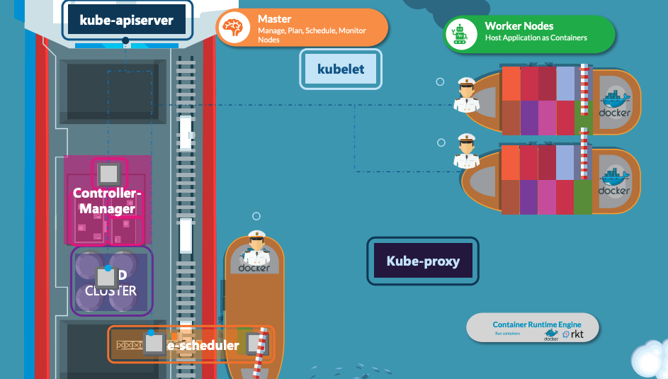

## Cluster Architecture

- worker node : 컨테이너를 로드할 수 있는 노드
    - pod(컨테이너의 집합-network 스택을 공유하여 localhost를 통해 서로에 도달 가능)를 호스팅
- control plane : 노드에 대한 정보를 저장하고, 노드 내 컨테이너의 위치를 모니터링 하고 추적
    - 워크 노드와 클러스터 내 pod를 관리
    - 여러 인스턴스에 분산되어 실행되고, 클러스터는 여러 노드를 실행 -> 고가용성 및 내결함성

### Control Plane Component
클러스터에 대해 스케줄링 등을 수행 & 클러스터 이벤트를 감지하고 반응
1. kube-apiserver
    - 쿠버네티스 API를 제공하는 API 서버
2. etcd 
    -  key-value 형태로 컨테이너가 어떤 노드에 위치하는지, 로드된 시간 등 모든 클러스터 데이터를 저장하는 DB
3. kube-scheduler
    - Kubelet(클러스터의 각 노드에서 실행되는 agent)가 pod를 실행할수 있도록 pod가 노드에 적합한지 확인하는 것
    - 새로 생성된 pod를 실행할 노드를 선택하는 컴포넌트
    - 즉, scheduler는 pod가 어디로 갈 지만 결정하고, 실제 pod를 노드에 위치하는 건 kubelet의 역할

4. kube-controller-manager
    - 스케줄러를 참고하여 정확한 수의 pod이 실행되게 하며, pod에 문제가 생겼을 시 감지하고 대응 
    - 노드 컨트롤러 : 노드가 다운되었을 때 통지와 대응 (상태 감시 및 대응 조치)
    - replication 컨트롤러 : 알맞은 수의 pod를 유지하기 위함
    - endpoint 컨트롤러 : 서비스와 pod를 endpoint로 연결
    - service account & token 컨트롤러 : namespace(클러스터 안에서 논리적으로 분리 - `ex:dev,stage,prod`)에 대한 계정과 API 접근 토큰을 생성

5. cloud-controller-manager 
    - 클러스터를 CSP의 API에 연결하며, CSP, 클러스터와만 각각 상호작용하는 컴포넌트를 구분함
    - 노드 컨트롤러 : 노드가 응답을 멈춘 후, 클라우드에서 삭제되었는지 확인 요청
    - 라우트 컨트롤러 : 클라우드 인프라에 경로 구성
    - 서비스 컨트롤러 : CSP 로드밸런서를 생성, 업데이터, 삭제 요청

### Node Component
1. kubelet
    - 클러스터의 각 노드에서 실행되는 agent
    - kube-apiserver를 경유하여 node에 컨테이너를 배포하거나 파괴
2. kube-proxy
    - worker node의 애플리케이션끼리 서로 통신이 가능하도록 함(`ex:db<->server`)
    - 노드의 네트워트 규칙을 관리
    - 내구성을 위해 daemonset으로 설치됨
3. container runtime
    - Docker, ContainerD, Rocket 등 런타임 엔진

